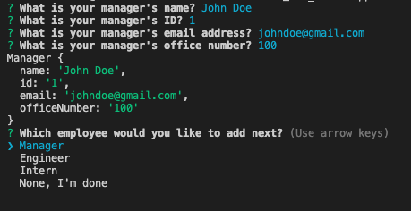
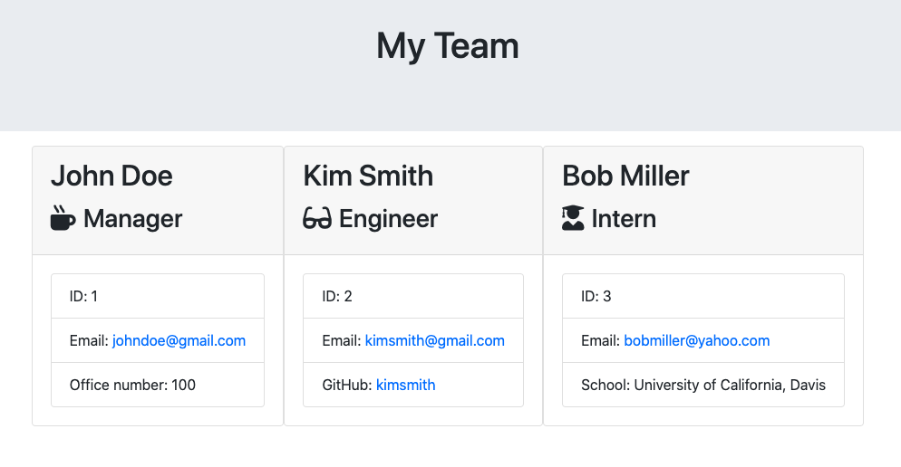

# Template Engine

## About
An app that generates an HTML file displaying the Employees on a team, based on user input into the terminal.  Created using test driven development, JavaScript, Node.js, Jest, and Inquirer.

## Usage
The user is prompted to answer questions about the manager of their team, then asked which employee type they would like to add next: Manager, Engineer, Intern, or none.  Each employee type has a different set of questions associated with it.  The questions contiue until the user says none, then it creates the HTML file to display each employee and thier information.  

## ScreenShots

